# SQL Assignment 1 - Items and Products Database

## Overview
This assignment covers SQL operations on two databases: **Brands** and **Products**, containing **ITEMS_TABLE** and **PRODUCTS_SALES_TABLE** respectively.

---

## 📋 Basic Questions

### 1. Create two Databases Name: Brands, and Products
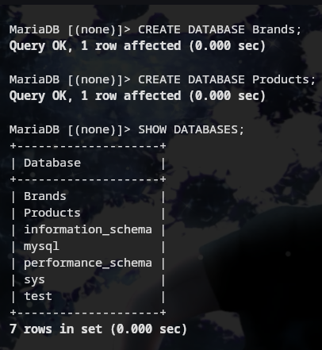

### 2. Create two tables in SQL Server name as ITEMS_TABLE in Brands database and PRODUCT_TABLE in Products database
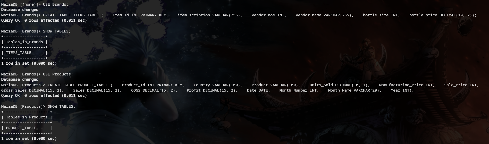

### 3. After Creating both the tables Add records in that tables (records are available in ITEMS_TABLE Sheet and PRODUCTS_TABLE Sheet)
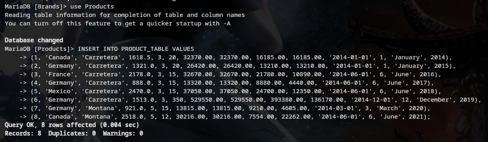
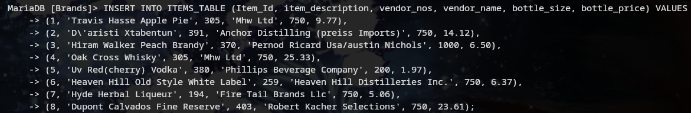

### 4. Delete those product having the Units Sold 1618.5, 888 and 2470
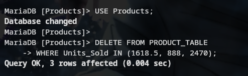

### 5. Select all records from the ITEMS_TABLE table
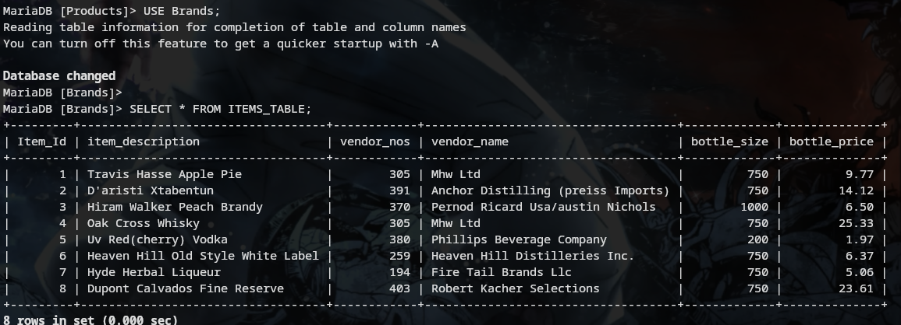

### 6. Select the item_description and bottle_price for all items in the ITEMS_TABLE table
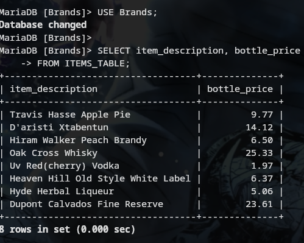

### 7. Find the item_description and bottle_price of items where bottle_price is greater than 20
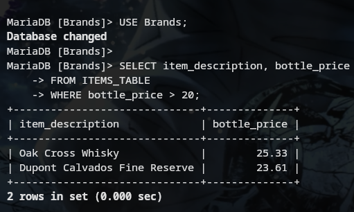

### 8. Select Unique Country from the product_sales table
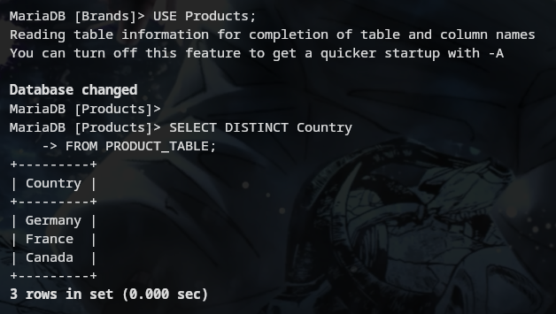

### 9. Count the number of Countries in the product_sales table
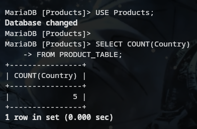

### 10. How Many Countries are there which contain the sales price between 10 to 20
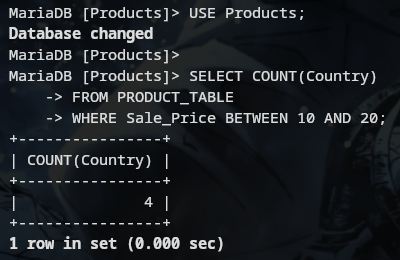

---

## 📊 Intermediate Questions

### 1. Find the Total Sale Price and Gross Sales
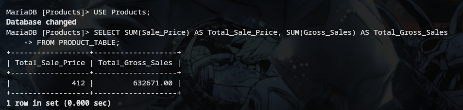

### 2. In which year we have got the highest sales
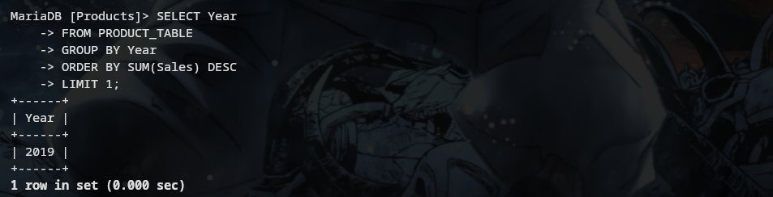

### 3. Which Product having the sales of $37,050.00
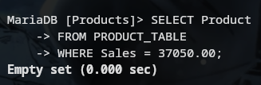

### 4. Which Countries lies between profit of $4,605 to $22,662.00
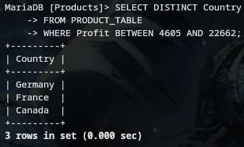

### 5. Which Product Id having the sales of $24,700.00
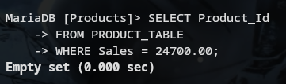

### 6. Find the total Units Sold for each Country
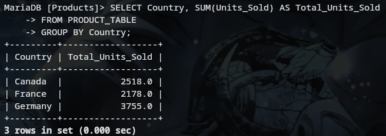

### 7. Find the average sales for each country
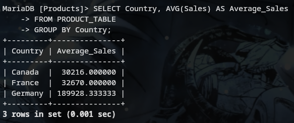

### 8. Retrieve all products sold in 2014
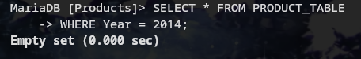

### 9. Find the maximum Profit in the product_sales table
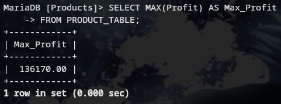

### 10. Retrieve the records from product_sales where Profit is greater than the average Profit of all records
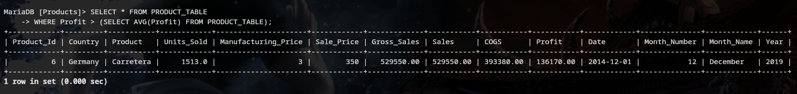

### 11. Find the item_description having the bottle size of 750

### 12. Find the vendor Name having the vendor_nos 305, 380, 391
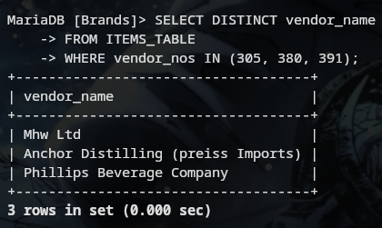

### 13. What is total Bottle_price
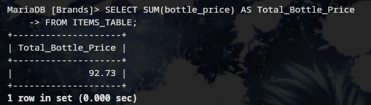

### 14. Make Primary Key to Item_id
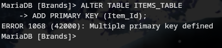

### 15. Which item id having the bottle_price of $5.06
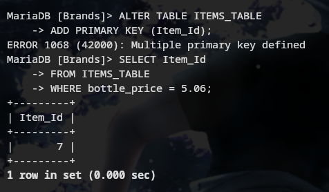

---

## 🚀 Advanced Questions

### 1. Apply INNER, FULL OUTER, LEFT JOIN types on both the table
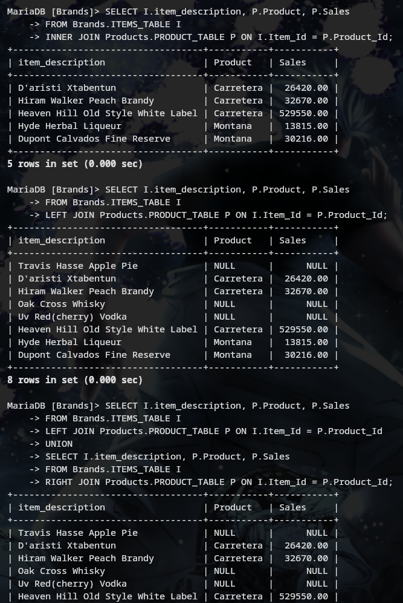

### 2. Find the item_description and Product having the gross sales of 13,320.00
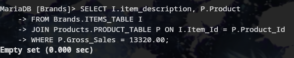

### 3. Split the Item_description Column into Columns Item_desc1 and Item_desc2
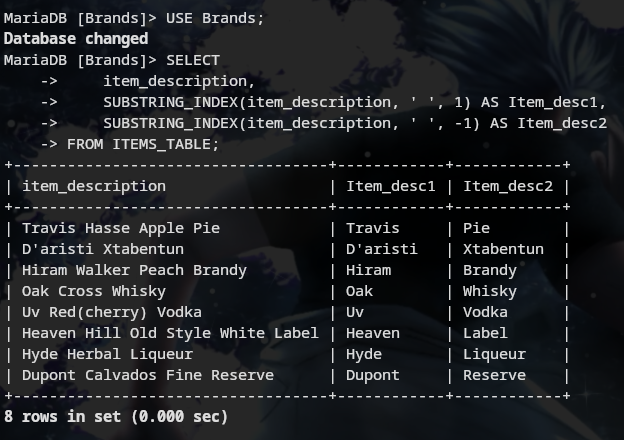

### 4. Find the top 3 most expensive items in the ITEMS_TABLE table
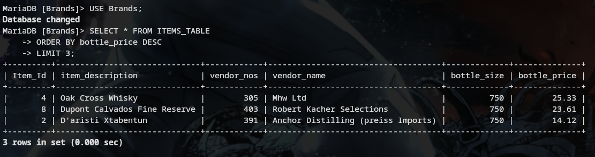

### 5. Find the total Gross Sales and Profit for each Product in each Country
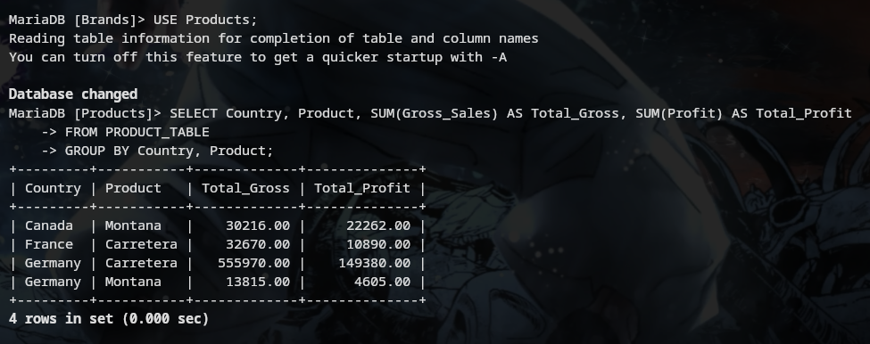

### 6. Find the vendor_name and item_description of items with a bottle_size of 750 and bottle_price less than 10
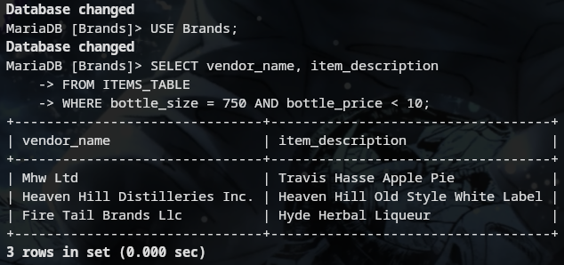

### 7. Find the Product with the highest Profit in 2019
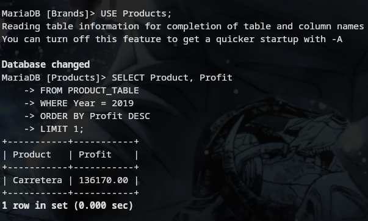

### 8. Retrieve the Product_Id and Country of all records where the Profit is at least twice the COGS
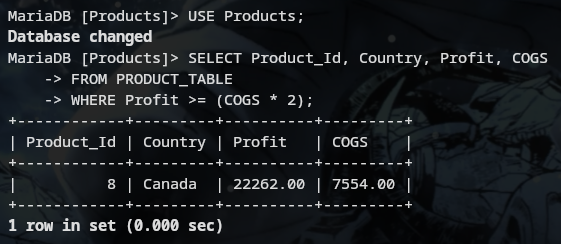

### 9. Find the Country that had the highest total Gross Sales in 2018
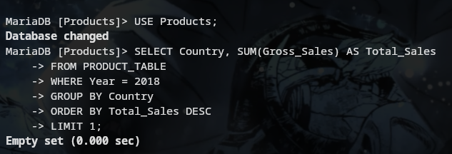

### 10. Calculate the total Sales for each Month Name across all years
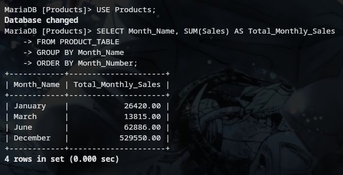

### 11. List the item_description and vendor_name for items whose vendor_nos exists more than once in the ITEMS_TABLE table
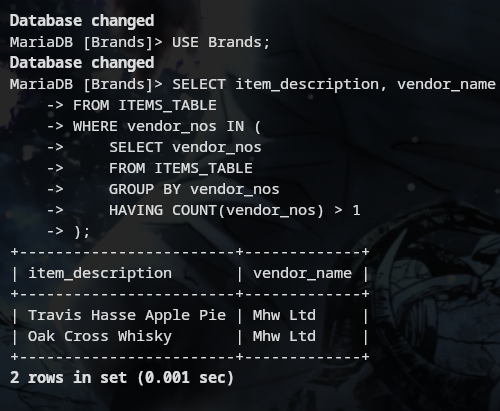

### 12. Find the average Manufacturing Price for Product in each Country and only include those Country and Product combinations where the average is above 3

---

## 💡 Super-Advanced Questions

### 1. Find the item_description and bottle_price of items that have the same vendor_name as items with Item_Id 1
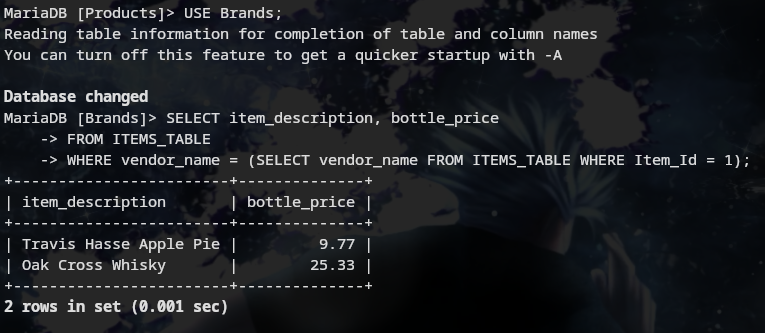

### 2. Create a stored procedure to retrieve all records from the ITEMS_TABLE table where bottle_price is greater than a given value
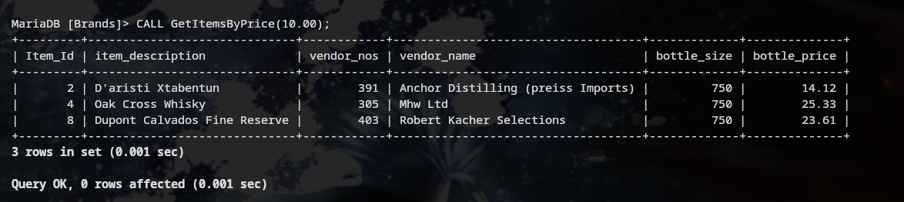

### 3. Create a stored procedure to insert a new record into the product_sales table
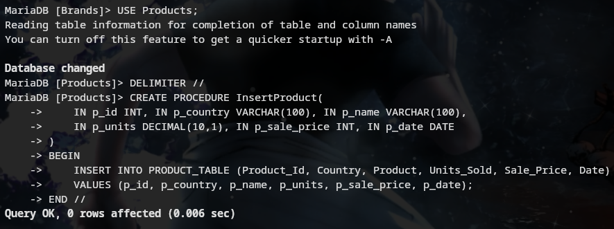

### 4. Create a trigger to automatically update the Gross_Sales field in the product_sales table whenever Units_Sold or Sale_Price is updated
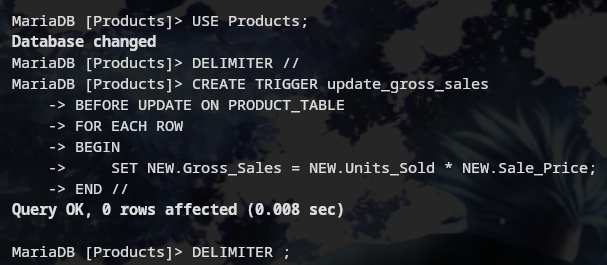

### 5. Write a query to find all item_description in the ITEMS_TABLE table that contain the word "Whisky" regardless of case
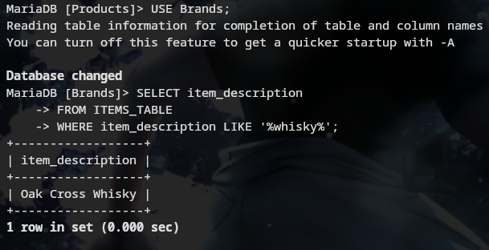

### 6. Write a query to find the Country and Product where the Profit is greater than the average Profit of all products
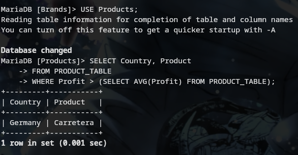

### 7. Write a query to join the ITEMS_TABLE and product_sales tables on a common field (e.g., vendor_nos) and select relevant fields from both tables
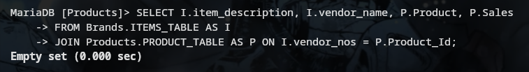

### 8. Write a query to combine item_description and vendor_name into a single string for each record in the ITEMS_TABLE table, separated by a hyphen
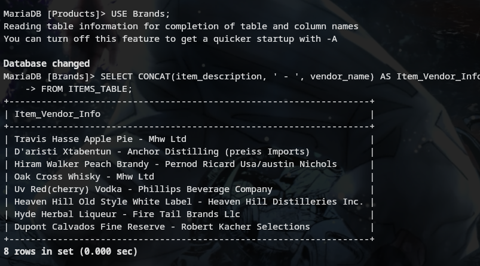

### 9. Write a query to display the bottle_price rounded to one decimal place for each record in the ITEMS_TABLE table
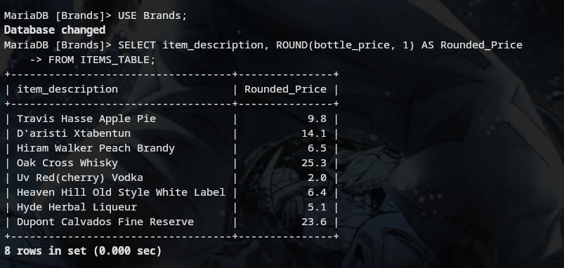

### 10. Write a query to calculate the number of days between the current date and the Date field for each record in the product_sales table
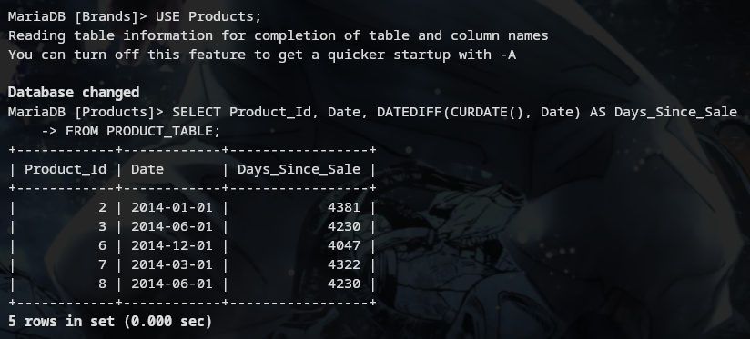

---
