# SQL Assignment 2 - Employee Database

## Overview
This assignment covers SQL operations on employee databases, containing **EmployeeDetails** and **EmployeeSalary** tables. The questions are organized into four parts covering basic to super-advanced SQL concepts.

---

## Basic Questions (Part 1)

### 1. SQL Query to fetch records that are present in one table but not in another table
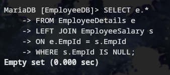

### 2. SQL query to fetch all the employees who are not working on any project
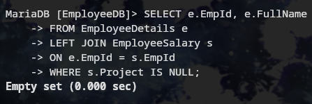

### 3. SQL query to fetch all the Employees from EmployeeDetails who joined in the Year 2020
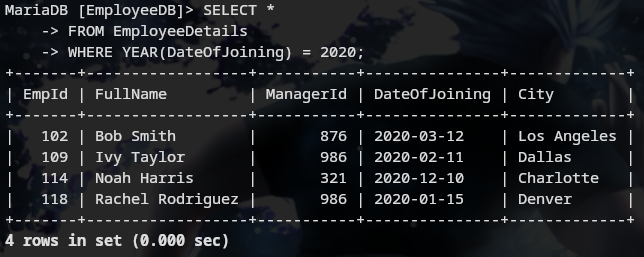

### 4. Fetch all employees from EmployeeDetails who have a salary record in EmployeeSalary
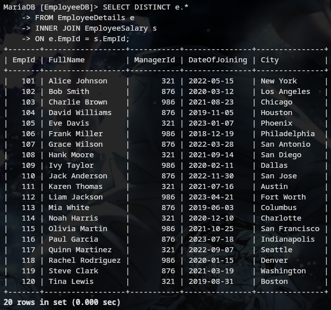

### 5. Write an SQL query to fetch a project-wise count of employees
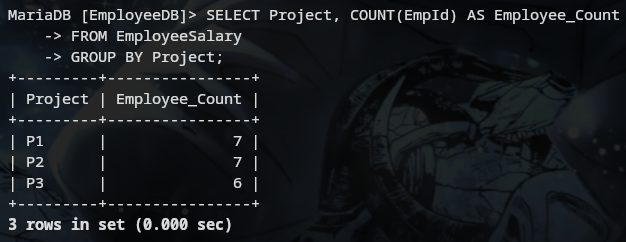

### 6. Fetch employee names and salaries even if the salary value is not present for the employee
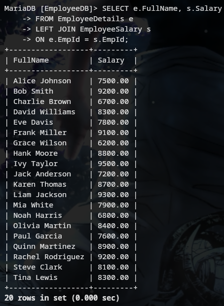

### 7. Write an SQL query to fetch all the Employees who are also managers

### 8. Write an SQL query to fetch duplicate records from EmployeeDetails
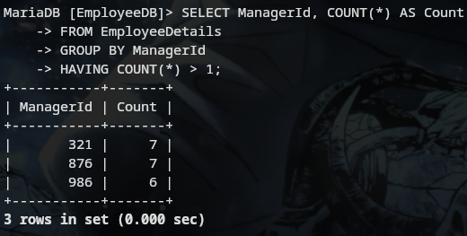

### 9. Write an SQL query to fetch only odd rows from the table
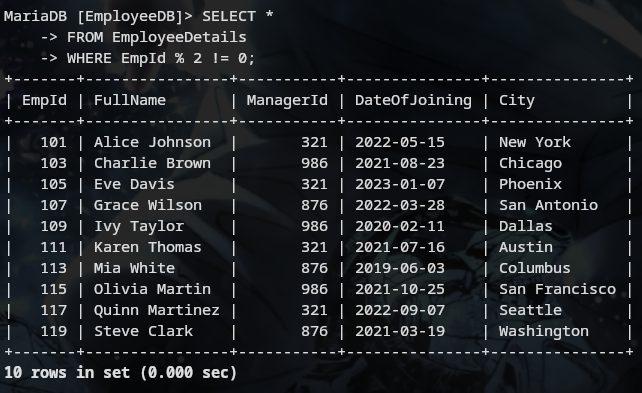

### 10. Write a query to find the 3rd highest salary from a table without top or limit keyword
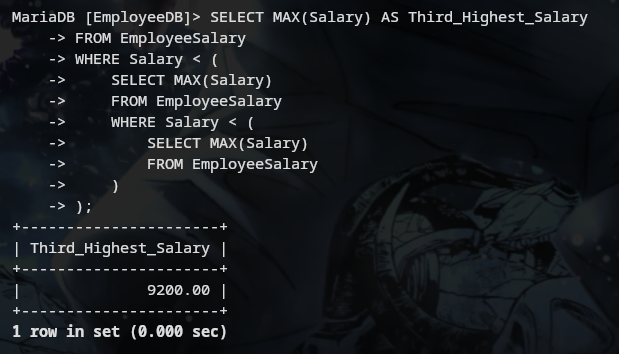

---

## Intermediate Questions (Part 2)

### 1. Write an SQL query to fetch the EmpId and FullName of all the employees working under the Manager with id – '986'
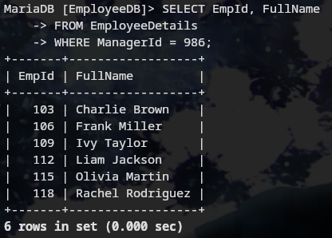

### 2. Write an SQL query to fetch the different projects available from the EmployeeSalary table
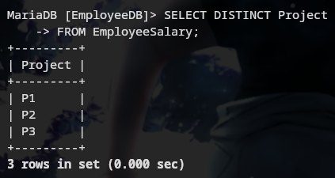

### 3. Write an SQL query to fetch the count of employees working in project 'P1'
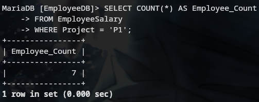

### 4. Write an SQL query to find the maximum, minimum, and average salary of the employees
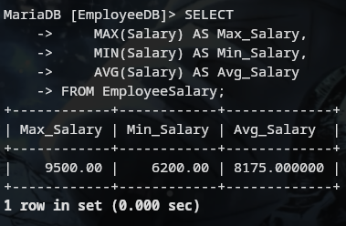

### 5. Write an SQL query to find the employee id whose salary lies in the range of 9000 and 15000
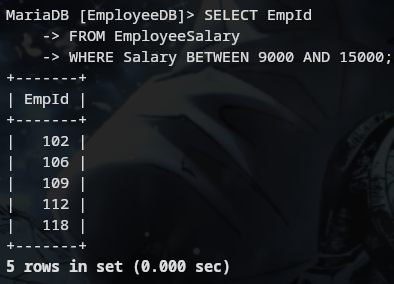

### 6. Write an SQL query to fetch those employees who live in Toronto and work under the manager with ManagerId – 321
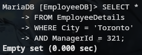

### 7. Write an SQL query to fetch all the employees who either live in California or work under a manager with ManagerId – 321

### 8. Write an SQL query to fetch all those employees who work on Projects other than P1
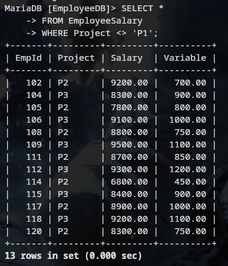

### 9. Write an SQL query to display the total salary of each employee adding the Salary with Variable value
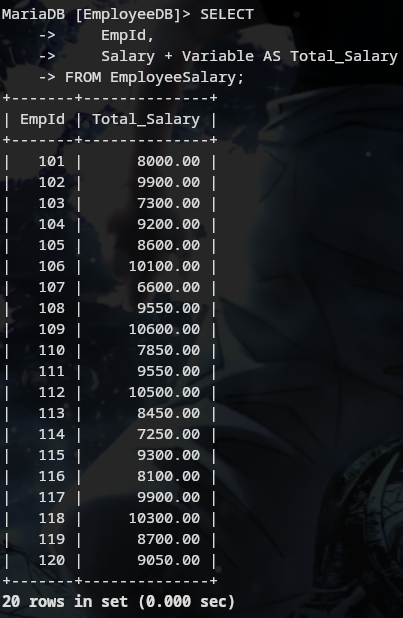

### 10. Write an SQL query to fetch the employees whose name begins with any two characters, followed by a text "hn" and ends with any sequence of characters
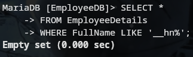

---

## Advanced Questions (Part 3)

### 1. Write an SQL query to fetch all the EmpIds which are present in either of the tables – 'EmployeeDetails' and 'EmployeeSalary'
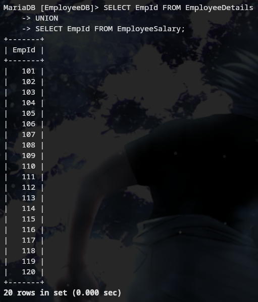

### 2. Write an SQL query to fetch common records between two tables
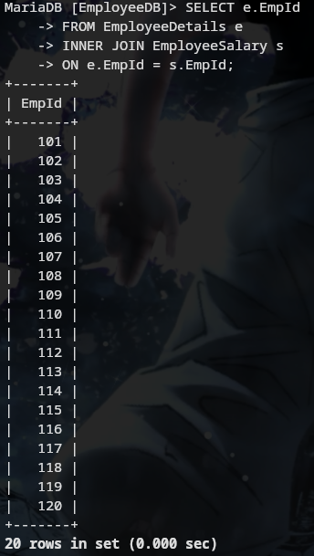

### 3. Write an SQL query to fetch records that are present in one table but not in another table
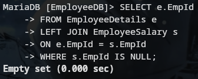

### 4. Write an SQL query to fetch the EmpIds that are present in both the tables – 'EmployeeDetails' and 'EmployeeSalary'
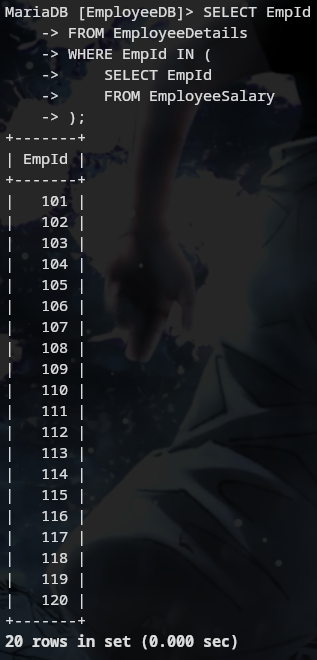

### 5. Write an SQL query to fetch the EmpIds that are present in EmployeeDetails but not in EmployeeSalary
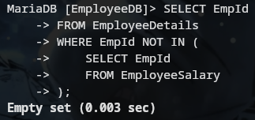

### 6. Write an SQL query to fetch the employee's full names and replace the space
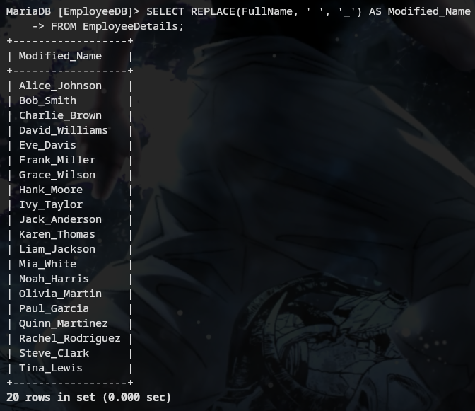

### 7. Write an SQL query to fetch the position of a given character(s) in a field
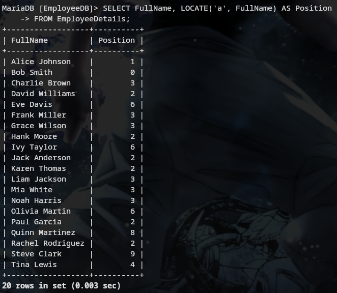

### 8. Write an SQL query to display both the EmpId and ManagerId together
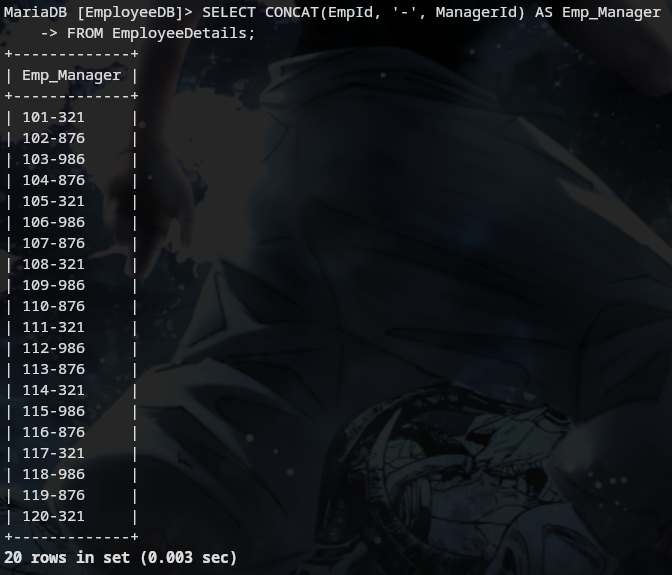

### 9. Write a query to fetch only the first name (string before space) from the FullName column of the EmployeeDetails table
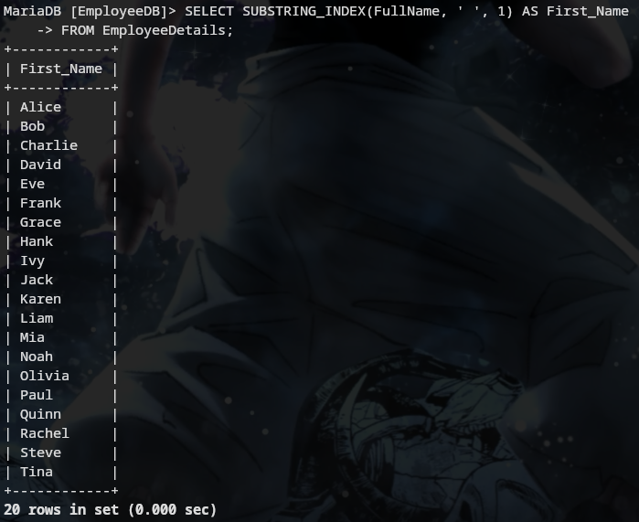

### 10. Write an SQL query to uppercase the name of the employee and lowercase the city values
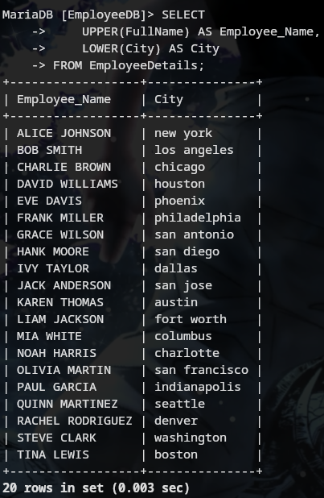

---

## Super-Advanced Questions (Part 4)

### 1. Write an SQL query to find the count of the total occurrences of a particular character – 'n' in the FullName field
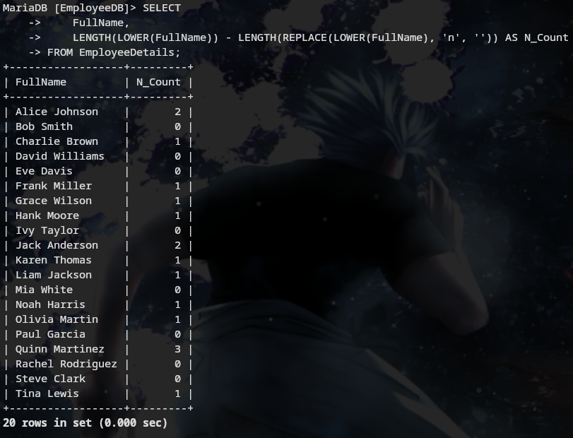

### 2. Write an SQL query to update the employee names by removing leading and trailing spaces
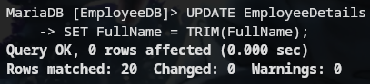

### 3. Fetch all the employees who are not working on any project
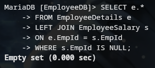

### 4. Write an SQL query to fetch employee names having a salary greater than or equal to 5000 and less than or equal to 10000
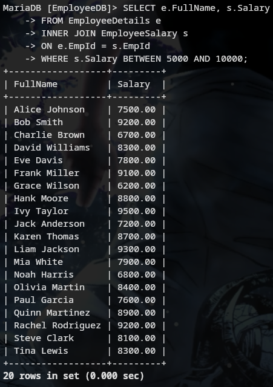

### 5. Write an SQL query to find the current date-time
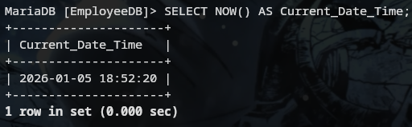

### 6. Write an SQL query to fetch all the Employee details from the EmployeeDetails table who joined in the Year 2020
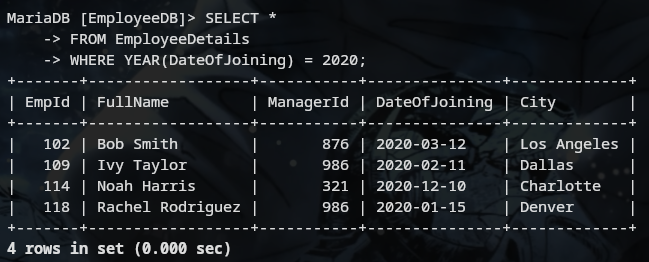

### 7. Write an SQL query to fetch all employee records from the EmployeeDetails table who have a salary record in the EmployeeSalary table
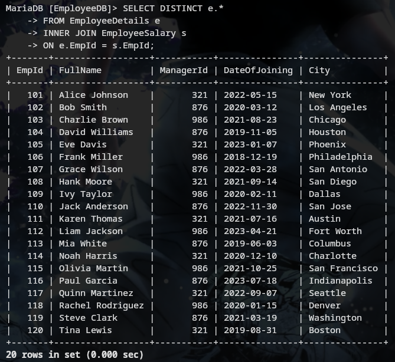

### 8. Write an SQL query to fetch the project-wise count of employees sorted by project's count in descending order
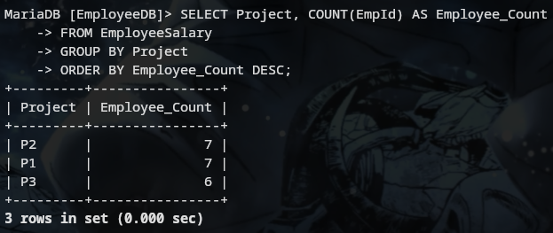

### 9. Write a query to fetch employee names and salary records. Display the employee details even if the salary record is not present for the employee
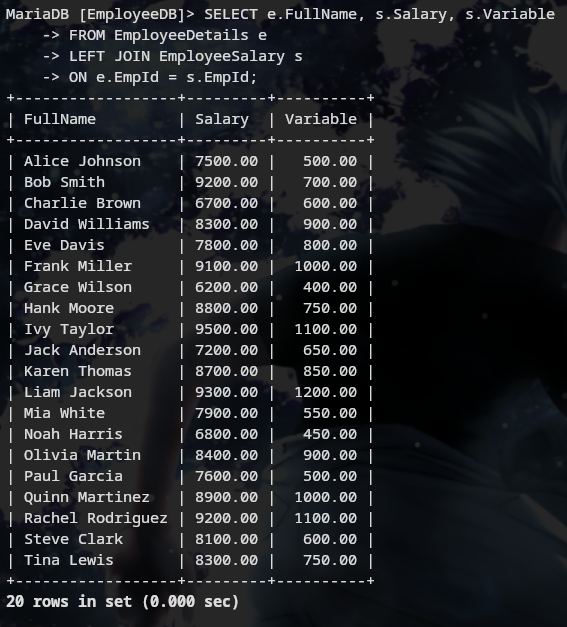

### 10. Write an SQL query to join 3 tables
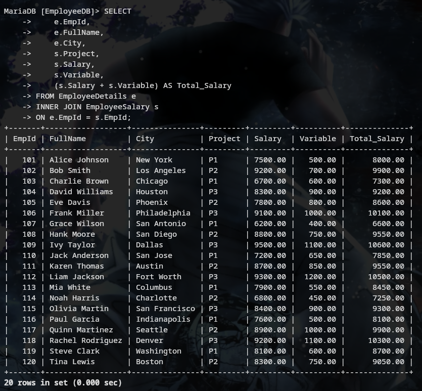

---
