# SQL Assignment 4 - University Database

## Overview
This assignment covers SQL operations on a university database system, containing **College_Table**, **Department_Table**, **Professor_Table**, and **Student_Table**. The questions are organized into three tasks covering database creation, data manipulation, and advanced SQL concepts.

---

## 📘 Task 1 - Database Setup and Table Creation

### Q1. Create University Database (any name)

**Explanation:** Creates a new university database.

### Q2. Use the University Database
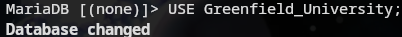
**Explanation:** Switches to the university database.

### Q2 (A). Create College_Table
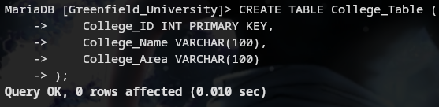
**Explanation:** Creates College table with primary key.

### Q2 (B). Create Department_Table
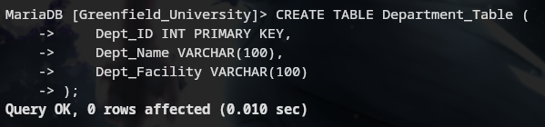
**Explanation:** Creates Department table.

### Q2 (C). Create Professor_Table
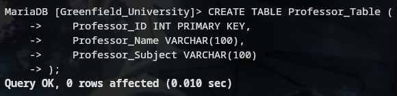
**Explanation:** Creates Professor table.

### Q2 (D). Create Student_Table
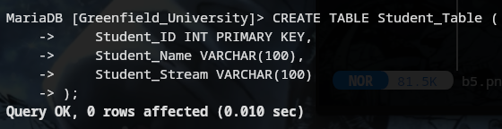
**Explanation:** Creates Student table.

### Q3. Apply Foreign Key on Department key from College_Table
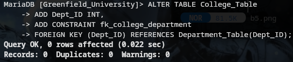
**Explanation:** Links College with Department using foreign key.

### Q4. Apply Foreign Key on Student_Table from Professor_Table
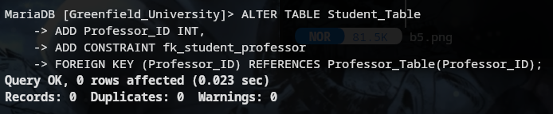
**Explanation:** Links Student with Professor using foreign key.

### Q5. Insert at least 10 records in each table

#### Insert into Department_Table
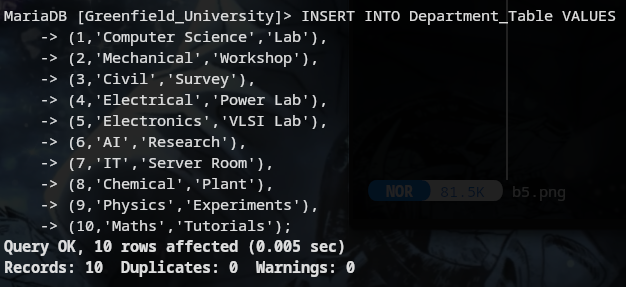

#### Insert into Professor_Table
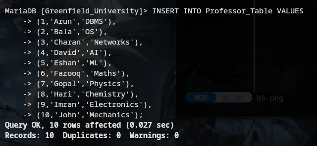

#### Insert into College_Table
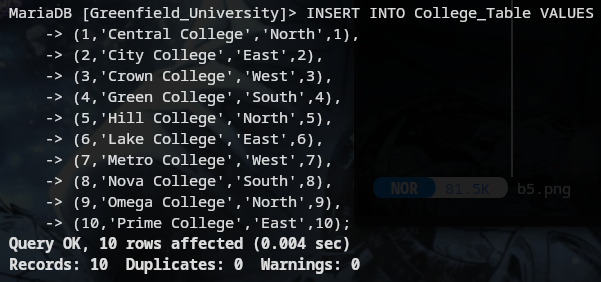

#### Insert into Student_Table

---

## 📗 Task 2 - Data Manipulation and Queries

### Q1. Give the information of College_ID and College_Name from College_Table
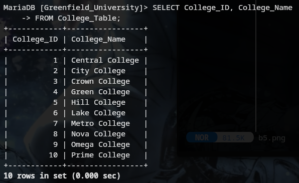
**Explanation:** Displays college ID and name.

### Q2. Show Top 5 rows from Student table
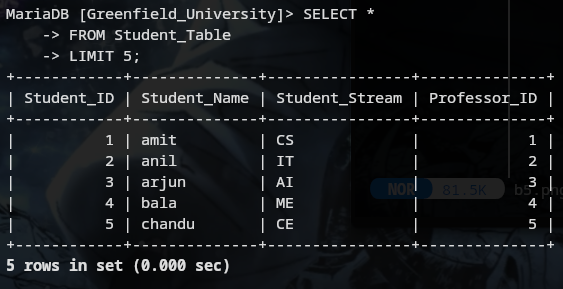
**Explanation:** Shows first 5 student records.

### Q3. What is the name of professor whose ID is 5
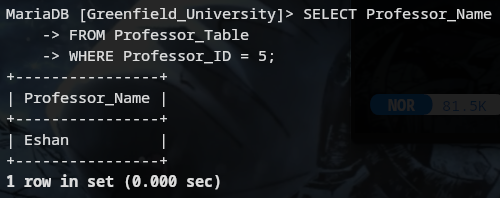
**Explanation:** Fetches professor name for ID 5.

### Q4. Convert the name of the Professor into Upper case
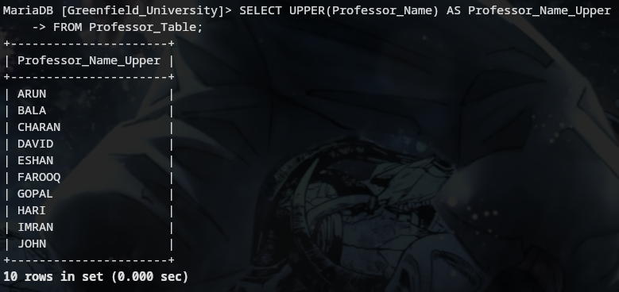
**Explanation:** Converts professor names to uppercase.

### Q5. Show me the names of those students whose name starts with 'a'
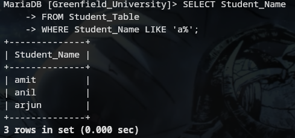
**Explanation:** Finds students whose names start with letter 'a'.

### Q6. Give the name of those colleges whose name ends with 'a'
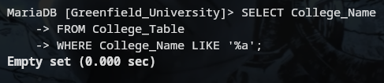
**Explanation:** Finds colleges whose names end with 'a'.

### Q7. Add one Salary column in Professor_Table
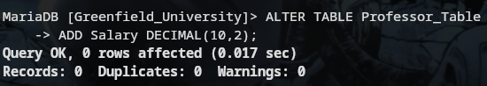
**Explanation:** Adds salary column to professor table.

### Q8. Add one Contact column in Student_Table
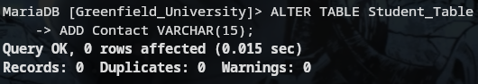
**Explanation:** Adds contact column to student table.

### Q9. Find the total Salary of Professor
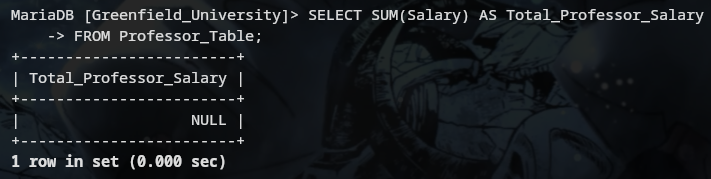
**Explanation:** Calculates total professor salary (NULL-safe).

### Q10. Change datatype of any one column of any one Table
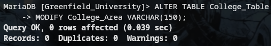
**Explanation:** Modifies datatype of College_Area column.

---

## 📙 Task 3 - Advanced SQL Operations

### Q1. Show first 5 records from Students table and Professor table combined
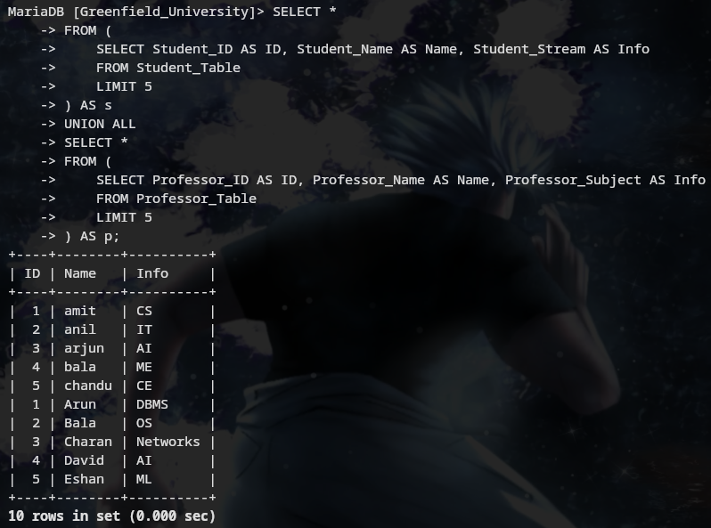
**Explanation:** Combines first 5 student and professor records using UNION.

### Q2. Apply INNER JOIN on all 4 tables together (Syntax mandatory)
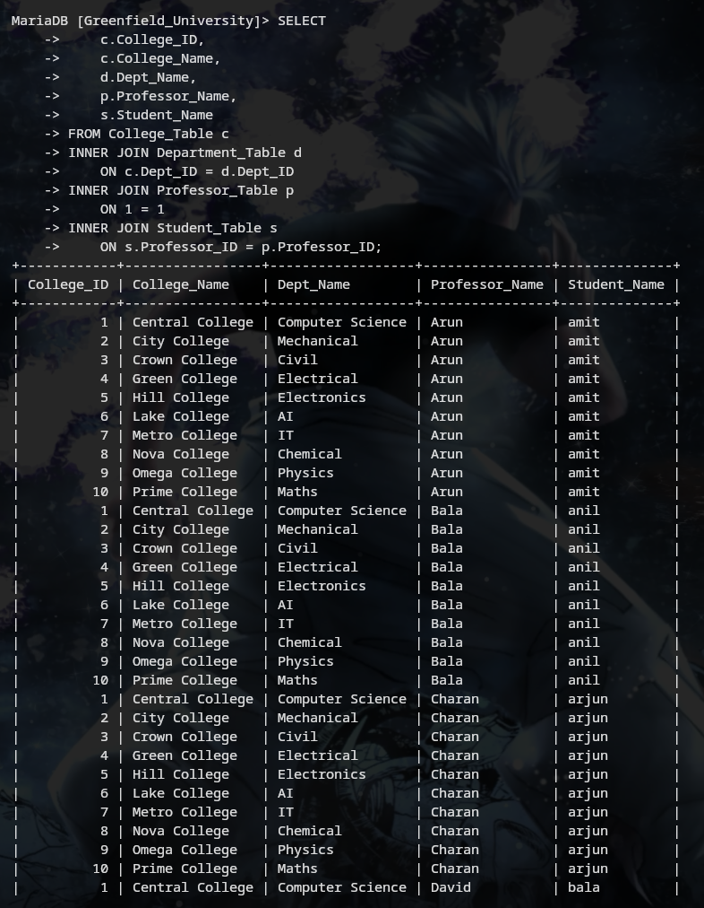
**Explanation:** Inner join across College, Department, Professor, and Student tables.

### Q3. Show some NULL values from Department table and Professor table
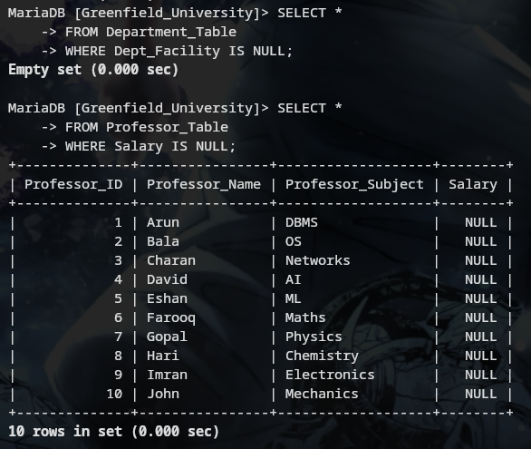
**Explanation:** Displays rows having NULL values from both tables.

### Q4. Create a VIEW from College Table - Show records whose college name starts with 'C'

#### Create View
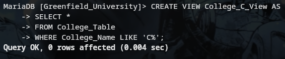
**Explanation:** Creates view for colleges starting with 'C'.

#### Display View Data
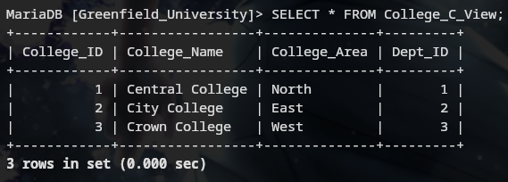
**Explanation:** Displays view data.

### Q5. Create Stored Procedure of Professor table (User gives Professor_ID → show full record)

#### Create Stored Procedure
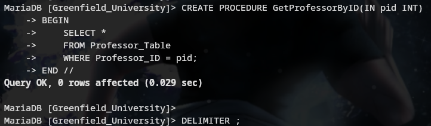
**Explanation:** Stored procedure to fetch professor details by ID.

#### Execute Stored Procedure
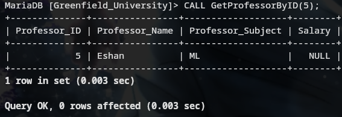
**Explanation:** Executes stored procedure with sample input.

### Q6. Rename the College_Table to College_Tables_Data
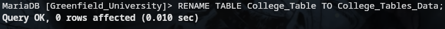
**Explanation:** Renames college table.

---

## Database Schema

### Tables Created:
- **College_Table** (College_ID, College_Name, College_Area, Dept_ID)
- **Department_Table** (Dept_ID, Dept_Name, Dept_Facility)
- **Professor_Table** (Professor_ID, Professor_Name, Professor_Subject, Salary)
- **Student_Table** (Student_ID, Student_Name, Student_Stream, Professor_ID, Contact)

### Relationships:
- College_Table → Department_Table (Foreign Key: Dept_ID)
- Student_Table → Professor_Table (Foreign Key: Professor_ID)

---
