# SQL Assignment 4 - University Database

## Overview
This assignment covers comprehensive SQL operations on a university database system. The questions progress from basic SELECT queries to advanced operations including JOINs, subqueries, and data manipulation.

---

## 📘 Task 1 - Basic SELECT Queries

### Q1. List all the records in the student table
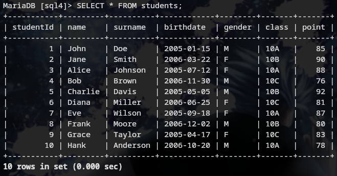

### Q2. List the name, surname and class of the student in the student table
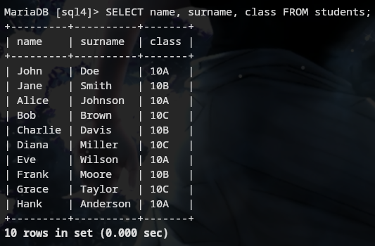

### Q3. List the gender Female (F) records in the student table
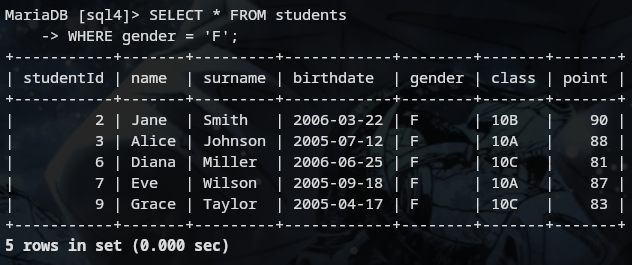

### Q4. List the names of each class in the way of being seen once in the student table
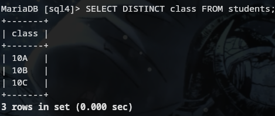

### Q5. List the students with Female gender and the class 10Math in the student table
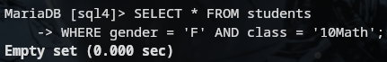

### Q6. List the names, surnames and classes of the students in the class 10Math or 10Sci in the student table
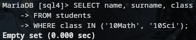

### Q7. List the students name, surname and school number in the student table
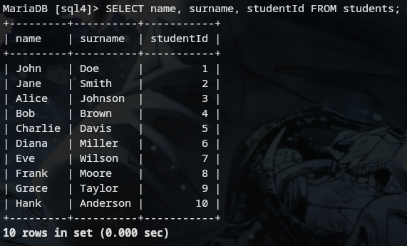

### Q8. List the students name and surname by combining them as "name surname" in the student table
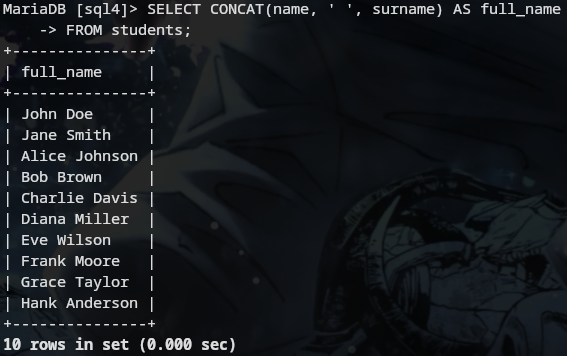

### Q9. List the students with the names starting with "A" letter in the student table
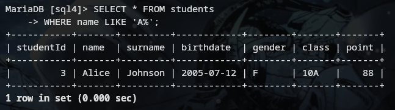

### Q10. List the book names and pages count with number of pages between 50 and 200 in the book table
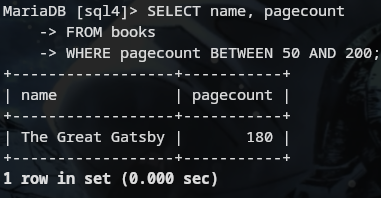

##  Task 2 - Advanced Filtering and String Operations

### Q11. List the students with names Emma, Sophia and Robert in the student table
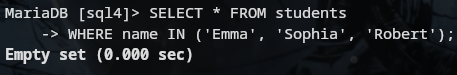

### Q12. List the students with names starting with A, D and K in the student table
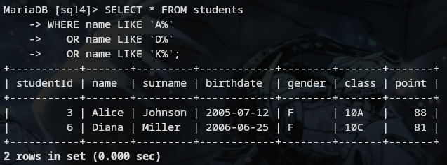

### Q13. List the names, surnames, classes and genders of males in 9Math or females in 9His in the student table
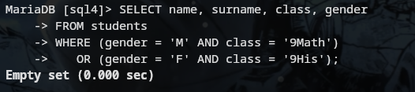

### Q14. List the males whose classes are 10Math or 10Bio
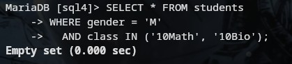

### Q15. List the students with birth year 1989 in the student table
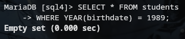

### Q16. List the female students with student numbers between 30 and 50
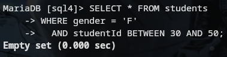

### Q17. List the students according to their names

### Q18. List the students by names; for those with same names, list them by their surnames
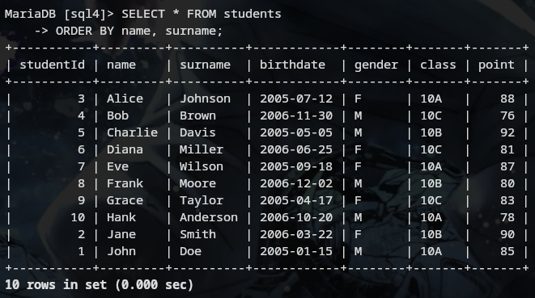

### Q19. List the students in 10Math by decreasing school numbers
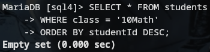

### Q20. List the first 10 records in the student chart
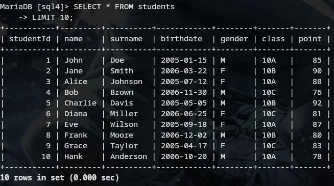

---

##  Task 3 - Aggregate Functions and Advanced Operations

### Q21. List the first 10 records name, surname and date of birth information in the student table
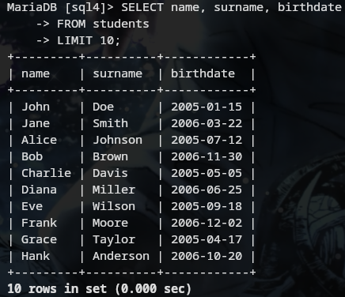

### Q22. List the book with the most page number
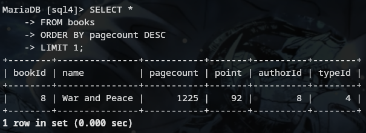

### Q23. List the youngest student in the student table
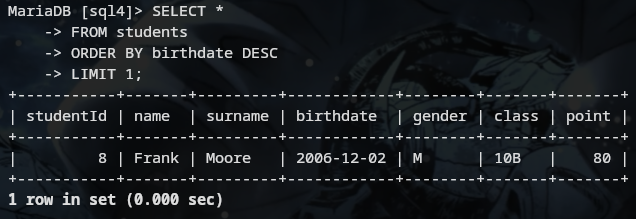

### Q24. List the oldest student in the 10Math class
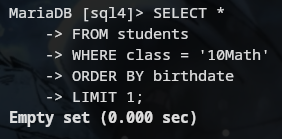

### Q25. List the books with the second letter "N"
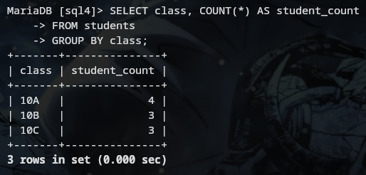

### Q26. List the students by grouping according to their classes
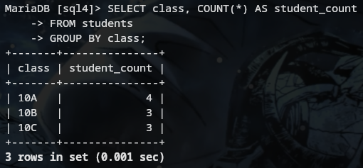

### Q27. List the students to be different in each questioning randomly
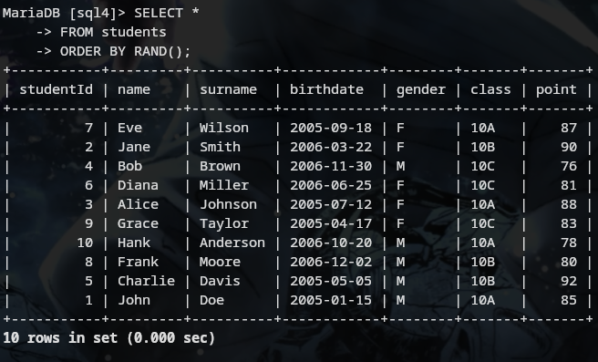

### Q28. Pick a random student from student table
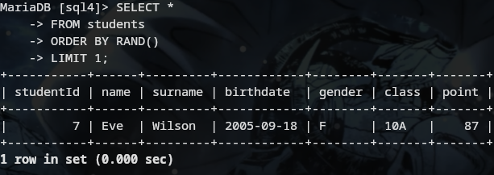

### Q29. Bring some random student's name, surname and number from class 10Math

---

## 🔧 Task 4 - Data Manipulation (INSERT, UPDATE, DELETE)

### Q30. Add the writer named Smith Allen to the authors table
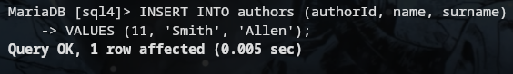

### Q31. Add the genre of biography to the genre table
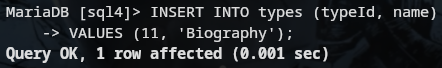

### Q32. Add 10Math Class male named Thomas Nelson, 9Bio class female named Sally Allen and 11His Class female named Linda Sandra in one question

### Q33. Add a random student in the students chart to the writers chart as an author
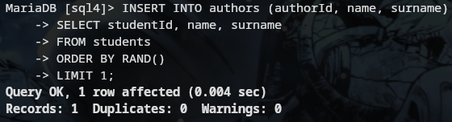

### Q34. Add students with student numbers between 10 and 30 as authors
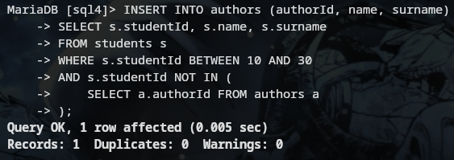

### Q35. Add the writer named Cindy Brown and make him write his writer number
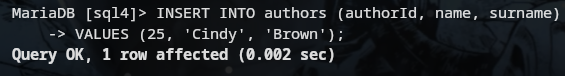

### Q36. Change the class of the student whose school number is 3 from 10Bio to 10His

### Q37. Transfer all the students in 9Math Class to 10Math Class
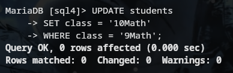

### Q38. Increase all of the students' score by 5 points
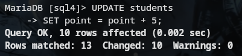

### Q39. Delete the author #25
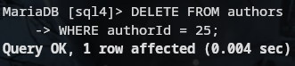

---

##  Task 5 - NULL Values and Special Queries

### Q40. List the students whose birth dates are null
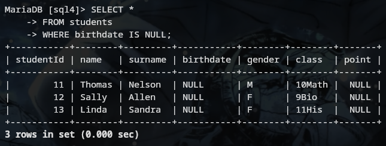

### Q41. List the name, surname and the dates of received books of the student
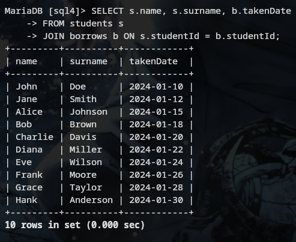

