# SQL Assignment 5 - Customers, Orders & Products Database

## Overview
This assignment covers comprehensive SQL operations on a customer-order-product database system. The questions progress from basic SELECT queries to advanced operations including JOINs, aggregate functions, subqueries, and complex analytical queries.

---

## 📘 Task 1 - Basic Queries and Simple JOINs

### Q1. Write a query to retrieve all records from the Customers table

### Q2. Write a query to retrieve the names and email addresses of customers whose names start with 'J'
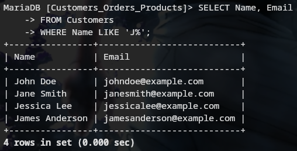

### Q3. Write a query to retrieve the order details (OrderID, ProductName, Quantity) for all orders
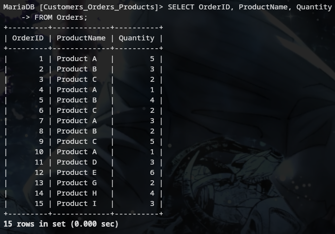

### Q4. Write a query to calculate the total quantity of products ordered
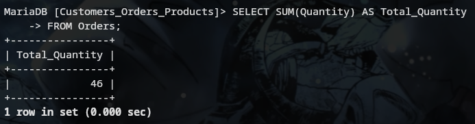

### Q5. Write a query to retrieve the names of customers who have placed an order
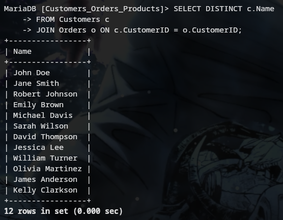

### Q6. Write a query to retrieve the products with a price greater than $10.00
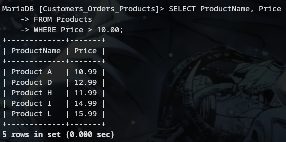

### Q7. Write a query to retrieve the customer name and order date for all orders placed on or after '2023-07-05'
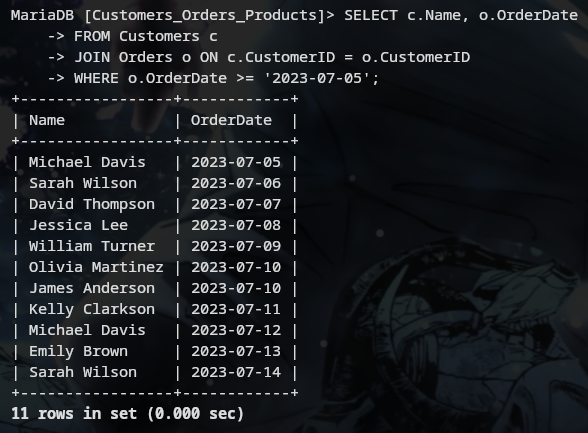

### Q8. Write a query to calculate the average price of all products
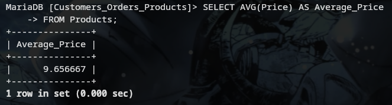

### Q9. Write a query to retrieve the customer names along with the total quantity of products they have ordered
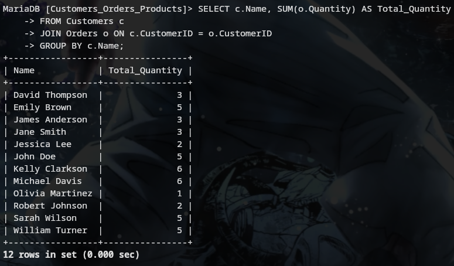

### Q10. Write a query to retrieve the products that have not been ordered
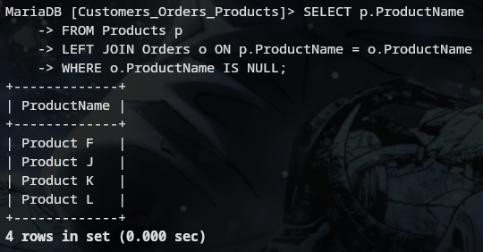

---

## 🔍 Task 2 - Advanced Queries and Analytics

### Q11. Write a query to retrieve the top 5 customers who have placed the highest total quantity of orders
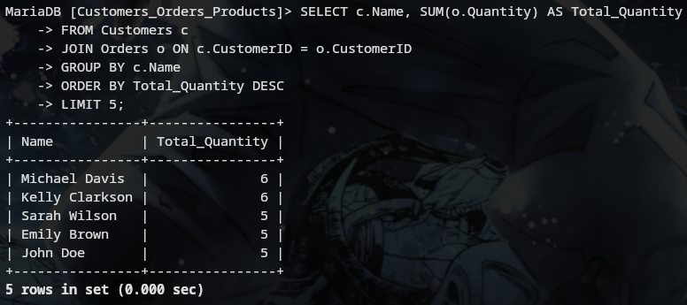

### Q12. Write a query to calculate the average price of products for each product category
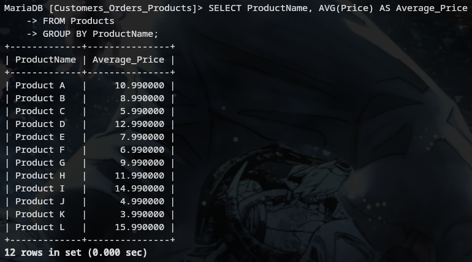

### Q13. Write a query to retrieve the customers who have not placed any orders
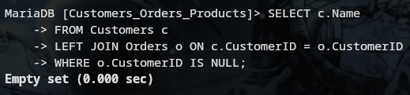

### Q14. Write a query to retrieve the order details (OrderID, ProductName, Quantity) for orders placed by customers whose names start with 'M'
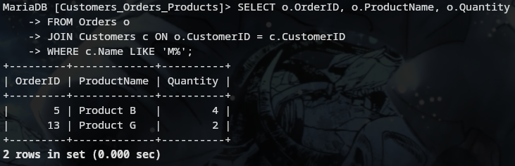

### Q15. Write a query to calculate the total revenue generated from all orders
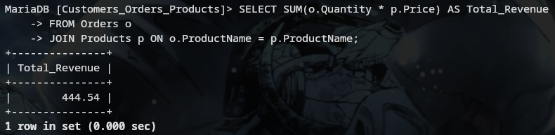

### Q16. Write a query to retrieve the customer names along with the total revenue generated from their orders
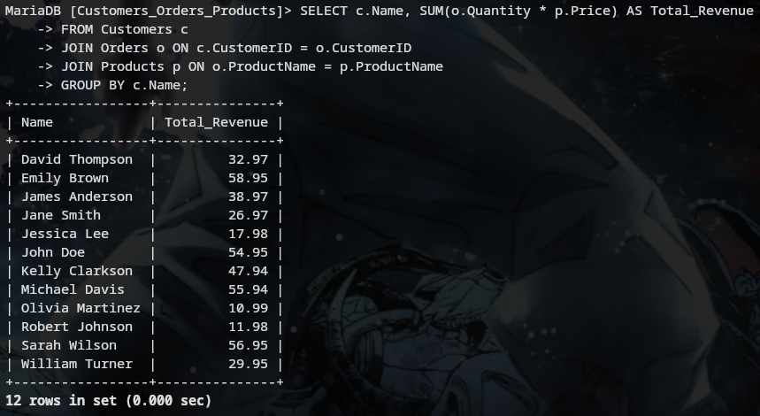

### Q17. Write a query to retrieve the customers who have placed at least one order for each product category
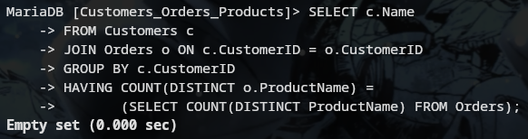

### Q18. Write a query to retrieve the customers who have placed orders on consecutive days
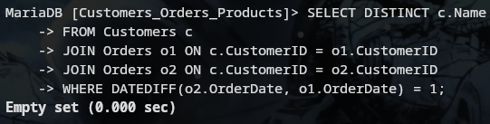

### Q19. Write a query to retrieve the top 3 products with the highest average quantity ordered
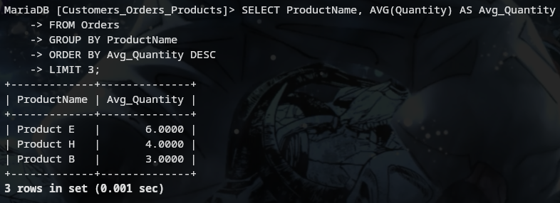

### Q20. Write a query to calculate the percentage of orders that have a quantity greater than the average quantity
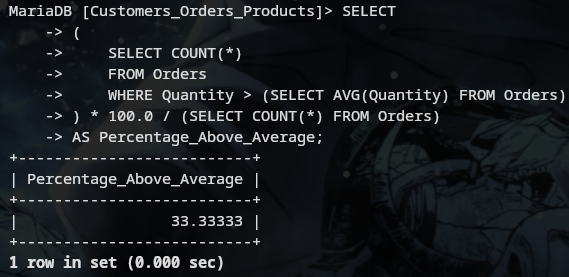

---
