# SQL Assignment 6 - Employee & Project Management Database

## Overview
This assignment covers comprehensive SQL operations on an employee and project management database system. The questions are divided into two parts: Basic to Intermediate queries (Set A) and Advanced queries for experienced candidates (Set B).

---

## Part A - Basic to Intermediate Queries

### Q1. Write a query to get all employee detail from "EmployeeDetail" table
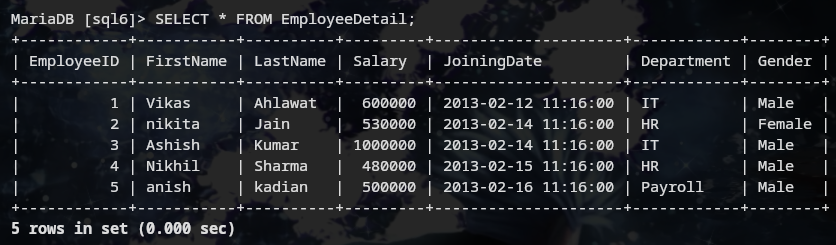

### Q2. Write a query to get only "FirstName" column from "EmployeeDetail" table
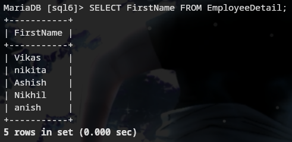

### Q3. Write a query to get FirstName in upper case as "First Name"
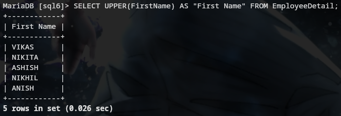

### Q4. Write a query to get FirstName in lower case as "First Name"
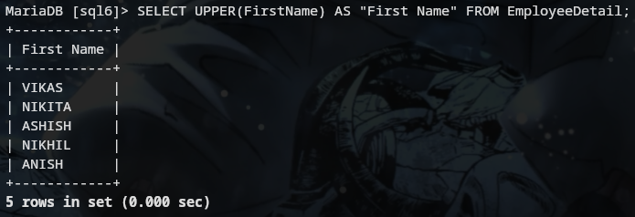

### Q5. Write a query for combine FirstName and LastName and display it as "Name" (also include white space between first name & last name)
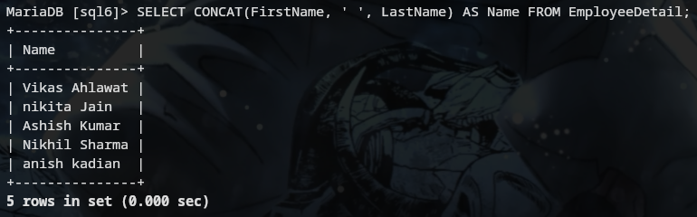

### Q6. Get employee detail whose name is "Vikas"
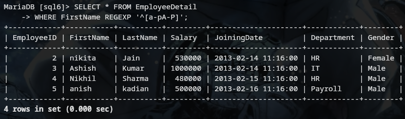

### Q7. Get all employee detail from EmployeeDetail table whose "FirstName" start with letter 'a'
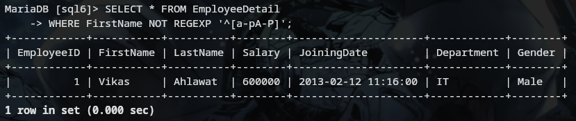

### Q8. Get all employee details from EmployeeDetail table whose "FirstName" end with 'h'
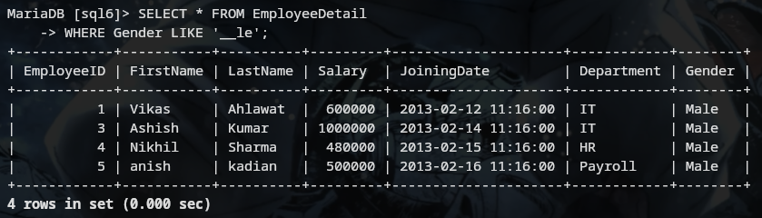

### Q9. Get all employee detail from EmployeeDetail table whose "FirstName" start with any single character between 'a-p'
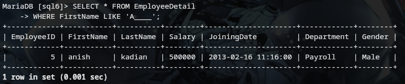

### Q10. Get all employee detail from EmployeeDetail table whose "FirstName" not start with any single character between 'a-p'
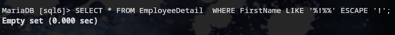

### Q11. Get all employee detail from EmployeeDetail table whose "Gender" end with 'le' and contain 4 letters
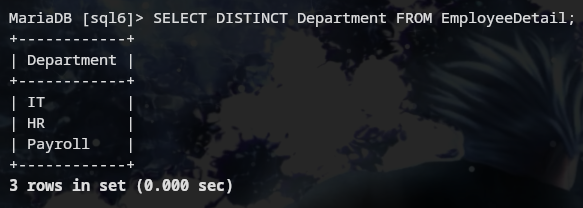

### Q12. Get all employee detail from EmployeeDetail table whose "FirstName" start with 'A' and contain 5 letters
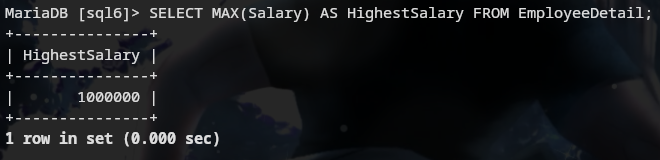

### Q13. Get all employee detail from EmployeeDetail table whose "FirstName" containing '%'. ex:-"Vik%as"
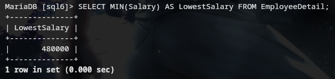

### Q14. Get all unique "Department" from EmployeeDetail table
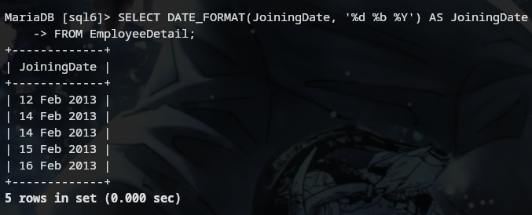

### Q15. Get the highest "Salary" from EmployeeDetail table
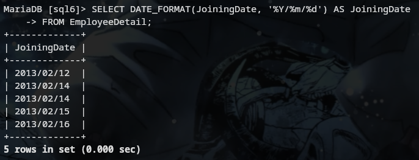

### Q16. Get the lowest "Salary" from EmployeeDetail table
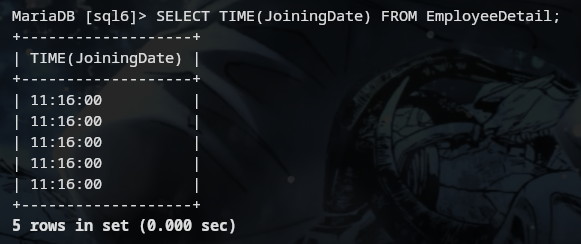

### Q17. Show "JoiningDate" in "dd mmm yyyy" format, ex- "15 Feb 2013"
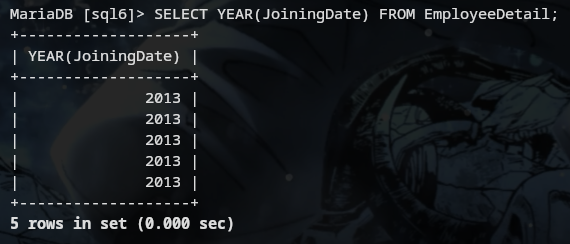

### Q18. Show "JoiningDate" in "yyyy/mm/dd" format, ex- "2013/02/15"
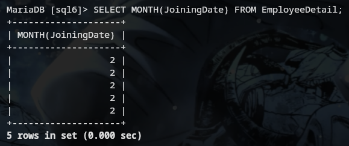

### Q19. Show only time part of the "JoiningDate"
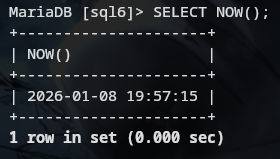

### Q20. Get only Year part of "JoiningDate"
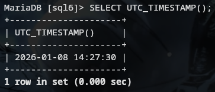

### Q21. Get only Month part of "JoiningDate"
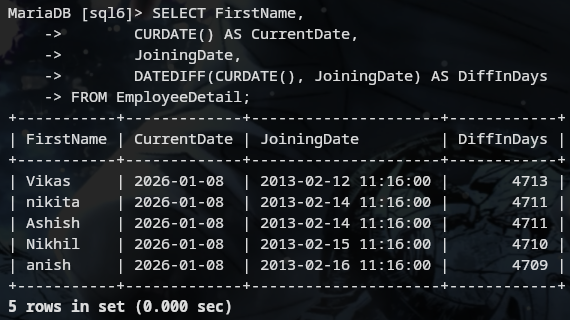

### Q22. Get system date
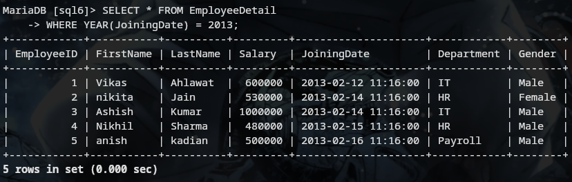

### Q23. Get UTC date

### Q24. Get the first name, current date, joiningdate and diff between current date and joining date in months

### Q25. Get the first name, current date, joiningdate and diff between current date and joining date in days
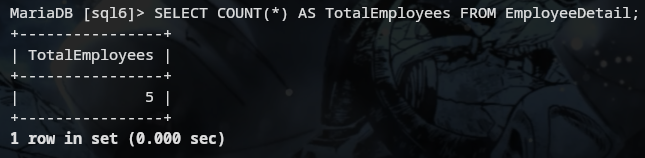

### Q26. Get all employee details from EmployeeDetail table whose joining year is 2013
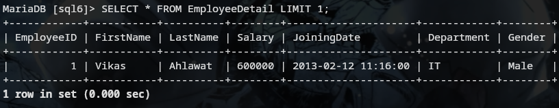

### Q27. Get all employee details from EmployeeDetail table whose joining month is Jan(1)
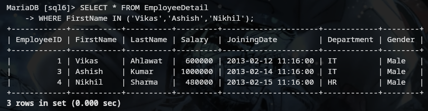

### Q28. Get how many employee exist in "EmployeeDetail" table
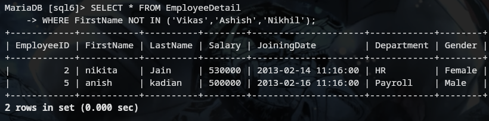

### Q29. Select only one/top 1 record from "EmployeeDetail" table
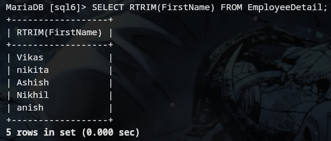

### Q30. Select all employee detail with First name "Vikas","Ashish", and "Nikhil"
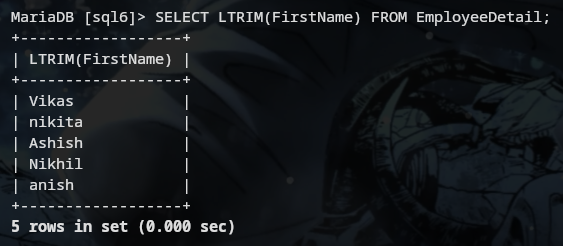

### Q31. Select all employee detail with First name not in "Vikas","Ashish", and "Nikhil"
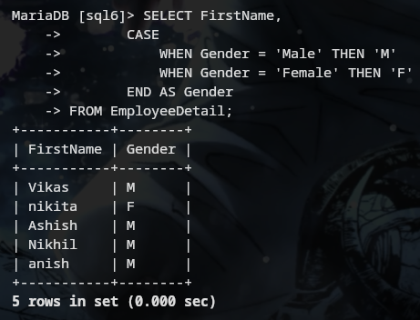

### Q32. Select first name from "EmployeeDetail" table after removing white spaces from right side
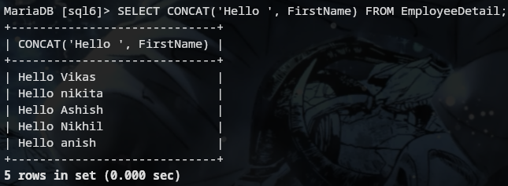

### Q33. Select first name from "EmployeeDetail" table after removing white spaces from left side
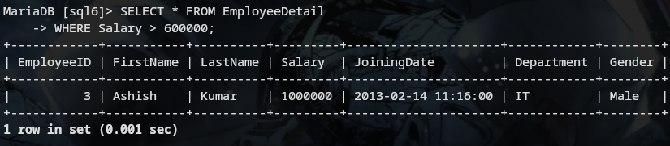

### Q34. Display first name and Gender as M/F (if male then M, if Female then F)
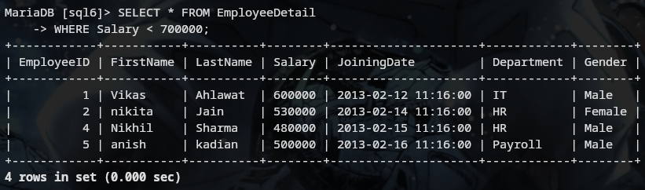

### Q35. Select first name from "EmployeeDetail" table prefixed with "Hello"
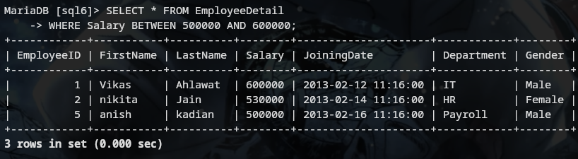

### Q36. Get employee details from "EmployeeDetail" table whose Salary greater than 600000

### Q37. Get employee details from "EmployeeDetail" table whose Salary less than 700000

### Q38. Get employee details from "EmployeeDetail" table whose Salary between 500000 and 600000

---

## Part B - Advanced Queries (For Experienced Candidates)

### Q1. Give records of ProjectDetail table

### Q2. Write the query to get the department and department wise total(sum) salary from "EmployeeDetail" table
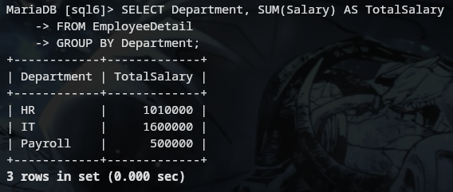

### Q3. Write the query to get the department and department wise total(sum) salary, display it in ascending order according to salary
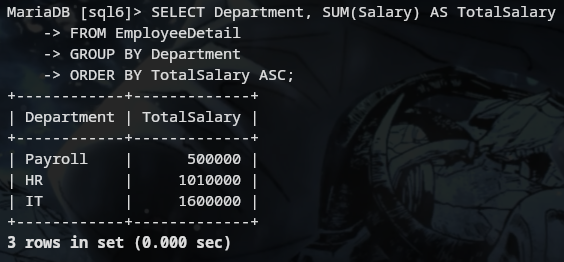

### Q4. Write the query to get the department and department wise total(sum) salary, display it in descending order according to salary
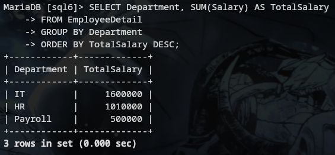

### Q5. Write the query to get the department, total no. of departments, total(sum) salary with respect to department from "EmployeeDetail" table
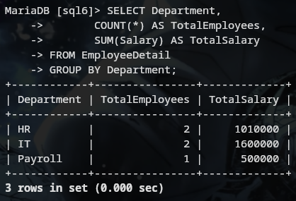

### Q6. Get department wise average salary from "EmployeeDetail" table order by salary ascending
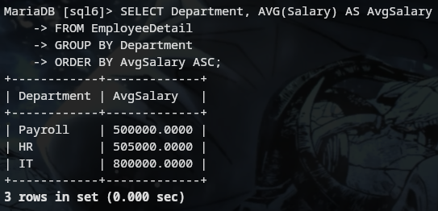

### Q7. Get department wise maximum salary from "EmployeeDetail" table order by salary ascending
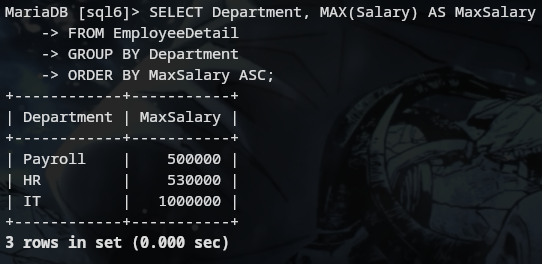

### Q8. Get department wise minimum salary from "EmployeeDetail" table order by salary ascending
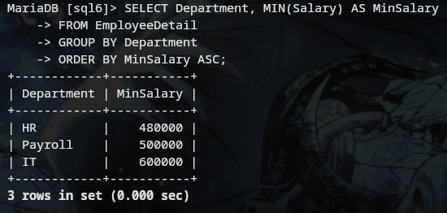

### Q9. Get department wise minimum salary from "EmployeeDetail" table order by salary ascending
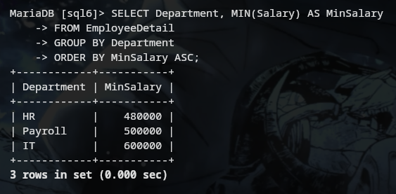

### Q10. Join both the table that is Employee and ProjectDetail based on some common parameter
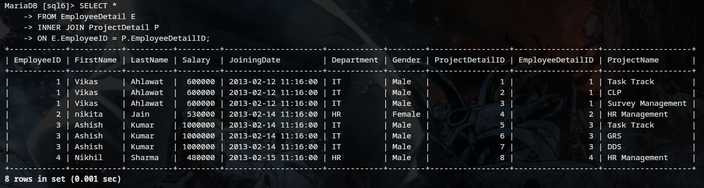

### Q11. Get employee name, project name order by firstname from "EmployeeDetail" and "ProjectDetail" for those employee which have assigned project already
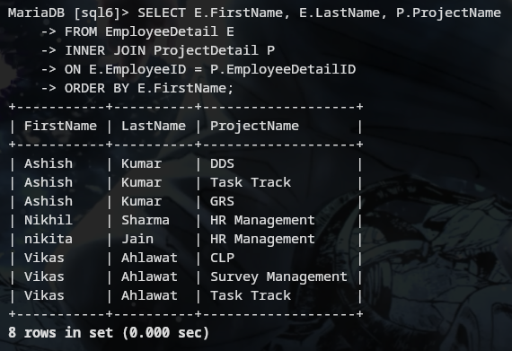

### Q12. Get employee name, project name order by firstname from "EmployeeDetail" and "ProjectDetail" for all employee even they have not assigned project
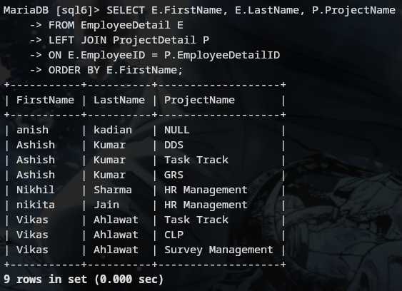

### Q13. Get employee name, project name order by firstname from "EmployeeDetail" and "ProjectDetail" for all employee if project is not assigned then display "-No Project Assigned"
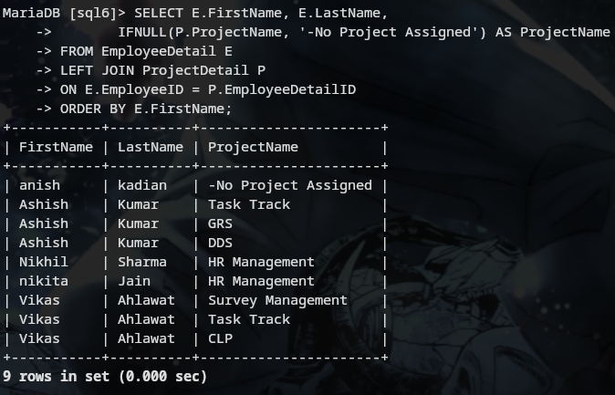

### Q14. Get all project name even they have not matching any employeeid, in left table, order by firstname from "EmployeeDetail" and "ProjectDetail"
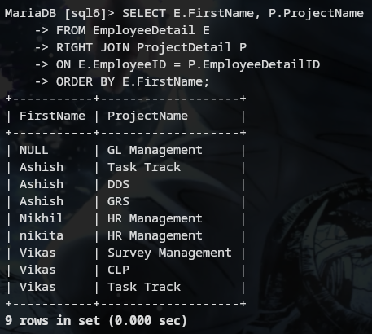

### Q15. Get complete record (employeename, project name) from both tables ([EmployeeDetail],[ProjectDetail]), if no match found in any table then show NULL
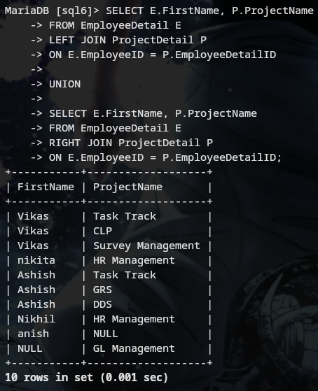

### Q16. Get complete record (employeename, project name) from both tables ([EmployeeDetail],[ProjectDetail]), if no match found in any table then show NULL
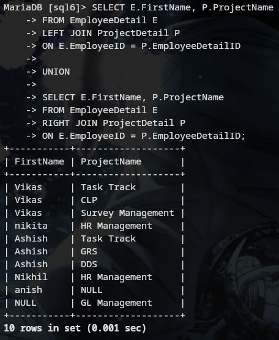

### Q17. Get complete record (employeename, project name) from both tables ([EmployeeDetail],[ProjectDetail]), if no match found in any table then show NULL
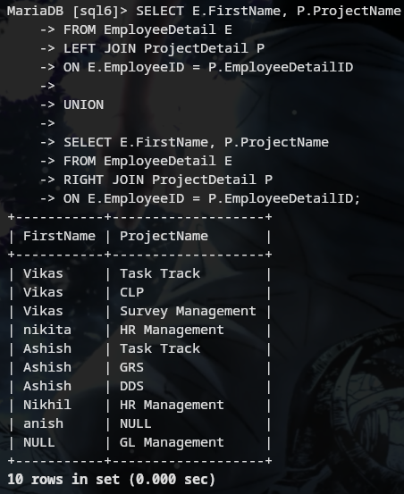

### Q18. Write down the query to fetch EmployeeName & Project who has assign more than one project
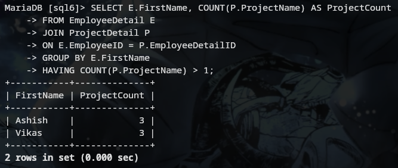

### Q19. Write down the query to fetch ProjectName on which more than one employee are working along with EmployeeName

### Q20. Apply Cross Join in Both the tables

---

